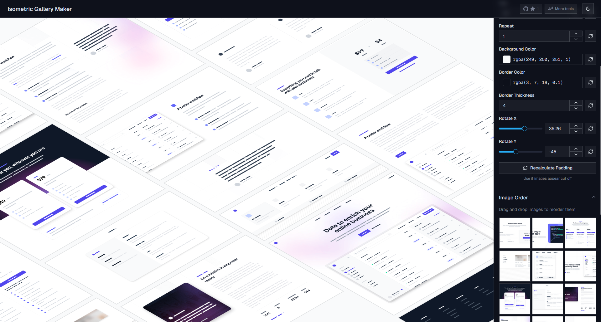

# Screenshoots

Decorate screens and build 3D isometric galleries — all in your browser.



## Try it now

Visit: [screenshoots.abd-dev.studio](https://screenshoots.abd-dev.studio/)

## What’s inside

- Screen Decorator: Preview any URL or app UI inside realistic device frames with overlays, gradients, and zoom.
- Isometric Gallery: Turn images into polished 3D isometric galleries with live customization and drag‑and‑drop.

## Features

- Device framing with overlay chrome (iPhone, Android, Mac) and presets
- Dark/light, controls, scrollbars, orientation toggles (when available per device)
- Custom background color, animated mesh gradients, optional content drop‑shadow
- Inner page zoom (same‑origin) with CSS scale fallback for cross‑origin embeds
- Smart layout with ResizeObserver for auto centering and responsive sidebars
- Drag & drop gallery building, live columns/gaps/rotation controls
- Reordering, fullscreen, and easy screenshot capture

## Pages

1) Screen Decorator — `/screenshoots/screen-decorator`
- Load any URL safely in a sandboxed iframe
- Choose device + variant (chrome/safari, dark mode, scrollbars, landscape)
- Customize frame (color, thickness, radius) and background/gradient
- Zoom the page content or scale the viewport when cross‑origin

2) Isometric Gallery — `/screenshoots/isometric-gallery`
- Add images from files or URLs
- Tweak columns, spacing, angles, and colors in real time
- Reorder via drag & drop and capture the final layout

## Quick Start

1. Install dependencies:

   ```bash
   npm install
   ```

2. Run the app:

   ```bash
   npm run dev
   ```

3. Open http://localhost:3000

## How to use

- Screen Decorator: Enter a URL, pick a device and options, adjust zoom/frame/background, then screenshot.
- Isometric Gallery: Add images, customize layout and angles, reorder, then screenshot or present fullscreen.

## Built with

- Next.js 15 + React 19
- Tailwind CSS
- Radix UI
- meshgrad (animated gradients)
- ResizeObserver‑driven layout
- React Infinite Canvas (gallery interactions)

## Author

**abdxdev** — [GitHub](https://github.com/abdxdev)

---

⭐ If you find this useful, consider starring the repo.
