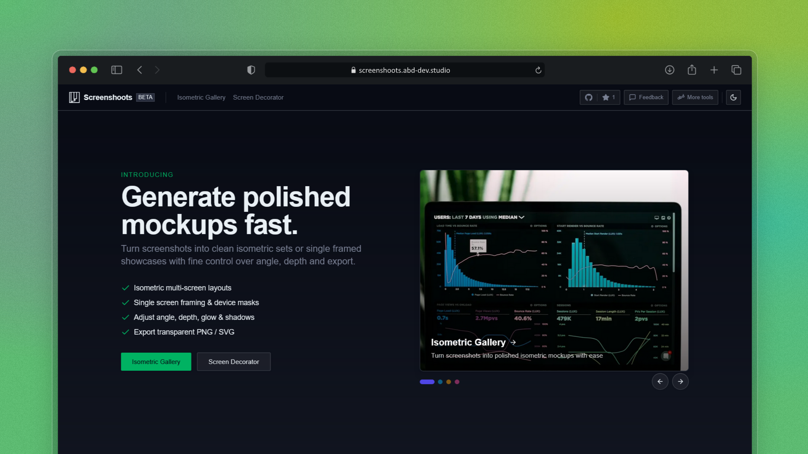

# Isometric Gallery Maker



Create stunning 3D isometric gallery mockups from your images with an easy-to-use web interface.

## Try it now

**Visit: [isometric-gallery-maker.abd-dev.studio](https://isometric-gallery-maker.abd-dev.studio/)**

## Features

- Drag & drop image gallery builder
- 3D isometric perspective views
- Real-time customization (columns, gaps, colors, rotations)
- Upload files or add from URLs

## Quick Start

1. **Install dependencies:**

   ```bash
   npm install
   ```

2. **Run the app:**

   ```bash
   npm run dev
   ```

3. **Open** [http://localhost:3000](http://localhost:3000)

## How to Use

1. **Add Images**: Upload files or paste URLs
2. **Customize**: Adjust columns, gaps, colors, and 3D rotation
3. **Organize**: Drag and drop to reorder images
4. **Export**: Use fullscreen mode and capture functionality

## Built With

- Next.js 15 + React 19
- Tailwind CSS
- Radix UI components
- React Infinite Canvas

## Author

**abdxdev** - [GitHub](https://github.com/abdxdev)

---

⭐ Star this project if you find it helpful!
